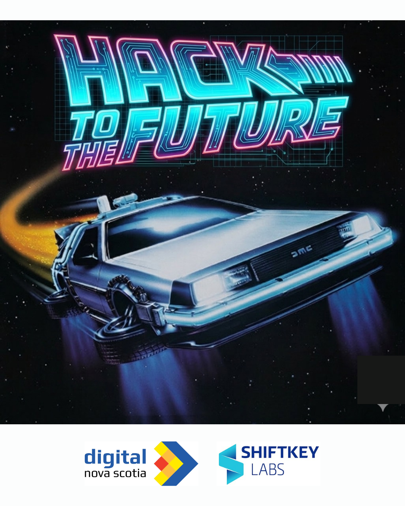
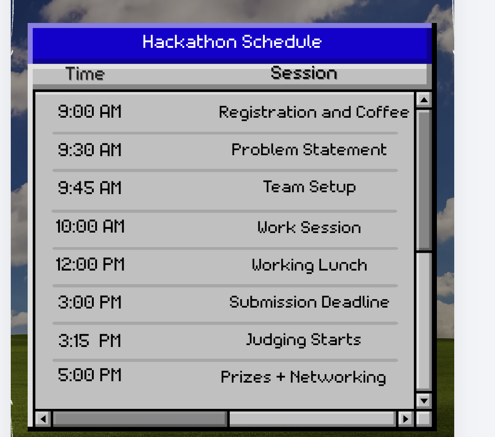
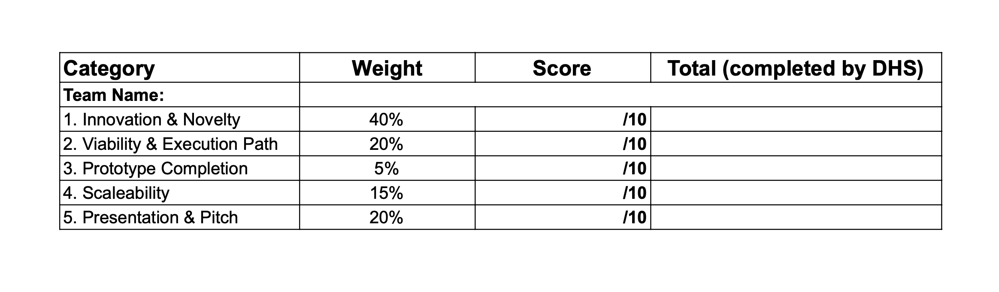

# Hack to the Future

Welcome to the official repo for the Hack to the Future hackathon, organized by the Dalhousie Hackers Society. Find all the information required to pariticipate (or judge the event) below. We are very excited to be hosting our society's first major hackathon & hope it to be the first of many. 

Keep calm and hack on!

## Index

1) [Schedule](#schedule)
2) [Problem Statement](#problem-statement)
3) [Score Card](#score-card)
4) [Evaluation Criteria](#evaluation-criteria)
5) [Thanks to](#thanks-to)

---

## Schedule

---

## Problem Statement

### The Question: 

How can technology shape a future where productivity and well-being go hand in hand? 

### The Challenge:

We challenge you to build an innovative solution that helps university students and/or early professionals succeed academically, or in their careers, without sacrificing their mental or physical health. 

Your team must address a real-world challenge related to healthy living or educational/career excellence. We are looking for tools that empower users to stop choosing between success and sanity, and instead, leverage technology to achieve both. 

### Key Focus Areas:

Your solution should accomplish any or all of the following: 

- demonstrate how technology can support smarter decision-making, 
- improve daily habits, 
- or create more balanced, efficient, and fulfilling lifestyles. 

### Consider focusing on: 

- **Wellness & Balance:** Tools that prevent burnout, encourage mindfulness, or promote healthy habits amidst a busy schedule. 
- **Organization & Focus:** Solutions that reduce cognitive load, streamline workflows, or help users master their time. 
- **Career Readiness & Growth:** Platforms that guide professional development, skill-building, or networking in a sustainable way. 
- **Academic Excellence:** Resources that make learning more effective, engaging, or less stressful.

---

## Score Card

## Evaluation Criteria

**Project Theme:** TBA

**Core Philosophy for Judging:** Innovation first, working prototypes rewarded, but ideas still competitive.

**Instructions:** Judges will provide a score out of 10 for each of the 4 categories on the provided rubric. We will apply the weighting after judges complete their evaluation in accordance with the weights indicated below.

| Category | Weight | Description & Guiding Questions |
| :--- | :--- | :--- | 
| **1. Innovation & Novelty** | **40%** | **The Big Idea: How fresh, original, and creative is the concept?**   • **Conceptual Originality:** Is this a novel solution or a unique twist? Does it identify a problem others have missed?   • **Human-Centric Creativity:** Does the idea reflect genuine human insight and lived experience? Ideas that appear to be generated by AI and lack personal depth will be penalized.   • **Future Potential:** Does this idea have legs? Could it grow into something meaningful with more time?    *Note: A team with slides only can still score highly here if their idea is brilliant and original.* | **/40** |
| **2. Viability & Execution Path** | **20%** | **The Plan: How well does the team understand what it would take to build this?**   • **Scope Awareness:** Is the idea appropriately scoped for a 6-hour hackathon (realistic) or wildly overambitious?   • **Technical Clarity:** Does the team have a clear vision of the tech stack, APIs, or tools needed to build their solution?   • **MVP Definition:** Can they articulate what a minimum viable product would look like and how their current prototype/demo fits into that vision? | **/20** |
| **3. Prototype Completion** | **5%** | **The Build: How much did they actually accomplish in 6 hours?**   • **Tangible Output:** Did they produce *something* functional, even if small? A working button, a script that runs, a Figma flow that connects?   • **Fidelity:** How polished is their prototype relative to the time constraint?    *Note: Due to the advent of generative AI, this metric has been kept intentionally low for scoring. However, we still want to encourage teams with a strong programming skillset to something original, which should be rewarded.* | **/5** |
| **4. Scaleability** | **15%** | **Does the concept have the potential for mass adoption?**   • **Ability for solution to scale:** Does the idea have legs? Is the market for this idea generally adoptable, or does it serve for a niche audience? Could the idea be scaled for a growing userbase?  | **/15** |
| **5. Presentation & Pitch** | **20%** | **The Story: How effectively did the team communicate their idea and demo?**   • **Problem/Solution Clarity:** Can they clearly explain the problem and their innovative solution in 3-4 minutes?   • **Demo Effectiveness:** Did they show what they built (even if it's a Figma walkthrough or a terminal output)?   • **Passion & Enthusiasm:** Does the team seem excited about their idea? Can they speak to it with genuine ownership? | **/20** |

---

### ⚠️ Important: Originality & AI Usage

We will be running the hackathon problem statement through Claude, DeepSeek, and ChatGPT prior to judging. Ideas that closely match AI-generated outputs and are executed along the lines outlined by these LLMs **will lose points** in the Innovation category. We're here to celebrate **human creativity and insight**—bring your own unique perspective!

---

### How Scoring Works

- **Base Score:** Each category is scored 1-10, then multiplied by its weight (e.g., Innovation score of 8 = 36 points toward the total).

---

## Thanks to:

tbc
